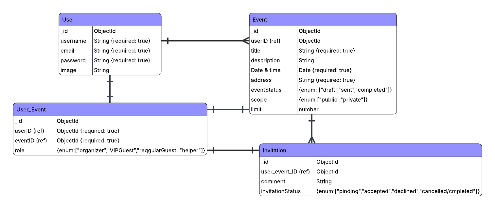
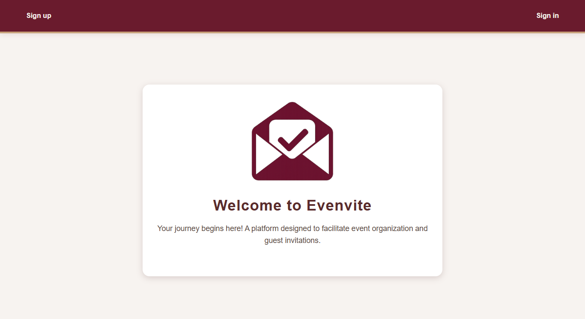
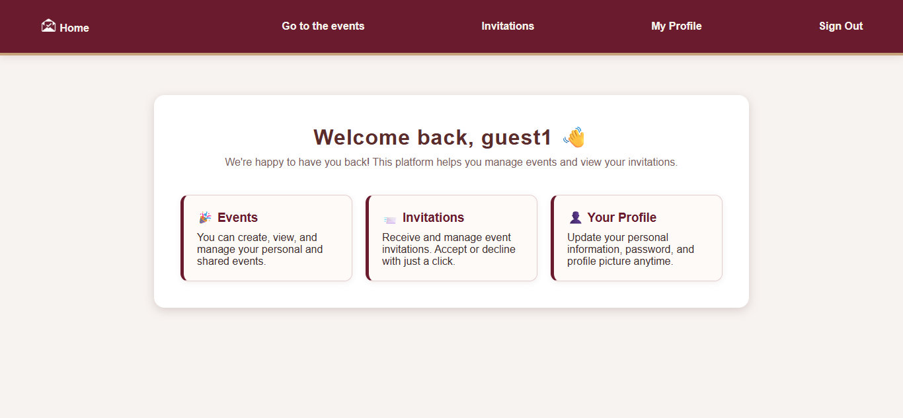

# Project2: Event-Organizer App

## Date: 1-10-2025

## By: Fatema Hussain, Fatema Mohammed, Fatema Ali

### ***Description:***
Event Organize is an application that allows users to send and receive invitations.

***
### ***Technologies used:***
- CSS
- HTML
- Nodejs
- MongoDB
- Mongoose
- Express.js
***
### ***Trello:***
Follow the project phases in [trello](https://trello.com/b/Icpr5auL)
***
### ***ERD:***

***
### ***WireFrames:***
#### Welcome page

#### Home Page

***
### ***Future Updates:***
- [ ] Determine roles for each guest.
- [ ] Live streaming of events within the app,including an interactive chat
***
### ***Credits:***
#### [Multiple populate](https://stackoverflow.com/questions/12821596/multiple-populates-mongoosejs)
#### [Find & Sort](https://stackoverflow.com/questions/4299991/how-to-sort-in-mongoose)
#### [Select multiple option](https://developer.mozilla.org/en-US/docs/Web/API/HTMLSelectElement/selectedOptions)
